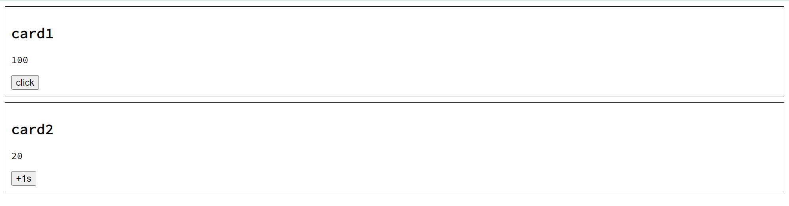
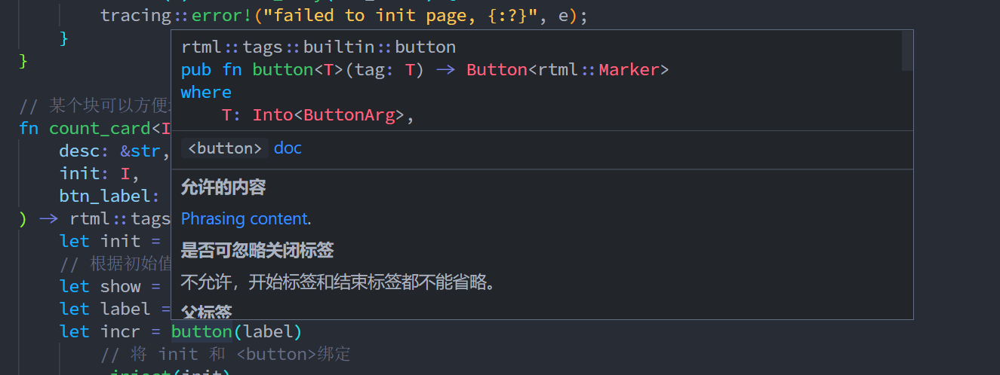
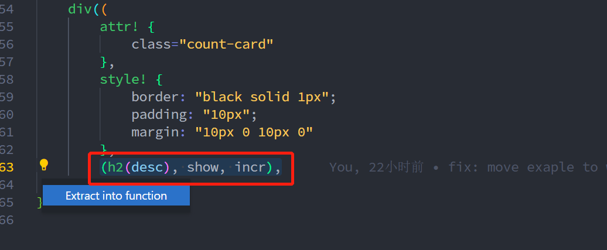

# rtml

以 Rust 风格编写网页.

## 入门

rtml 是一个让你以 Rust 代码实现编写网页的库, 换言之, rtml 让用户可以操作 html/css/js.

以最简单的 hello world 为例, `cargo new` 新建一个项目, 在添加 rtml 依赖, 在 main.rs 中添加如下代码

```rust
use rtml::attr;
use rtml::tags::*;

#[rtml::page]
// 函数返回值必须为 Html, 即 html 根元素
fn main() -> Html {
    // 使用与 html 标签同名函数构造对应的 html 元素
    html((
        // attr! 用于设置 html 元素属性, 这这里设置一个最常见 lang 属性
        attr! { lang="zh-cn" },
        // 属性之后可跟着样式设置(可选)和子元素, 这里忽略样式设置
        (
            head((
                // 对于 meta 等标签, 我们不关心内容, 只传入属性也是合法的参数
                meta(attr! { charset="utf-8" }),
                // 直接传入字符串, 浮点数, 整数, 布尔值会被自动设置为 html 元素文字内容
                title("RTML Simple Template"),
            )),

            body((
                h1("hello world!"),
                h1("你好, 世界!")
            )),
        ),
    ))
}
```

rtml::page 是一个方便用户使用的过程宏, 它的作用不过是将被修饰函数返回值作为整个 html 页面模板, 打印并保存到 CARGO_MANIFEST_DIR 目录下的 pkg 目录(目录名可改, 见 rtml::page 宏介绍). 真正有用的是我们在 main 函数中通过调用与 html 标签同名的函数创建标签, 在 Rust 代码中尽量与直接书写 html 的风格接近.

如 body() 类似于 \<body\>\</body\>, 只不过 rtml 省略了一次标签名, 同时用小括号代替了开闭元素. 此外先属性后子元素的参数位置要求, 也于 html 中的 \<div id="app"\>xxxx\</div\> 对应.

接着我们通过 cargo run 运行这个项目, 运行成功后会在项目 pkg 目录下生成 index.html(文件名可改, 见 rtml::page 宏介绍) 文件.

```html
<html lang="zh-cn">
    <head>
        <meta charset="utf-8"></meta>
        <title>RTML Siple Template</title>
</head>
    <body>
        <h1>hello world!</h1>
        <h1>你好, 世界!</h1>
</body>
</html>
```

可以看到我们传递的 html 标签和属性都被正确渲染了, 用浏览器打开即可看到网页效果. 这个例子可以在 [examples/hello-world](./examples/hello-world/) 找到.

### 样式设置

和在 html 中设置标签样式类似, 有两种方法

1. 用户可以在单个标签上通过 style 属性设置
2. 通过 link 或 style 标签, 引入样式文件或嵌入 css 代码

对于第一种方式, rtml 提供了 style! 将其作为标签构造参数传入标签同名函数.

```rust
div((
    style! { color: "red" },
    p("should be red text")
))
```

值得注意的是 rtml 标签参数, 样式和内容的传参方式非常灵活, 你可以只传任意一个, 下面三个 div 函数实参都是合法的

```rust
div((
    div("content only"),
    // attribute only
    div(attr! { id = "app" }),
    // style only
    div(style! { color: "red" })
))
```

如果需要同时传入属性,样式和内容, 除了要求有内容时, 内容必须放在最后位置外, 对属性和样式顺序无要求.

```rust
div((
    div((attr! {}, "attr and then content, OK")),
    div((style! {}, "style and then content, OK")),
    div((attr! {}, style! {}, "attr then style and then content, OK")),
    div((style! {}, attr! {}, "order don't matter for attr and style")),
    div((style! {}, attr! {}, "order don't matter for attr and style")),
    // no content is also ok
    div((style! {}, attr! {})),
))
```

对于第二种方式, 在需要地方构建 style 标签即可, 比如你想通过 CDN 引入 zui 的 css 库

```rust
head((
    link(attr! {
        rel = "stylesheet",
        href = "https://cdn.bootcdn.net/ajax/libs/zui/1.10.0/css/zui.min.css"
    }),
))
```

### 标签内容

同 html 标签一样, 一个标签通常可以包含字符或子标签, 但因为 Rust 是静态强类型语言, 标签同名函数可以当做内容的类型有如下几种.

#### 基本字面类型

String, &str, bool, u8~u64, i8~i64, f32, f64 和 ()

```rust
// empty content
p(())

p("abc")
p(format!("hello, {}", "rookie"))
p(true)
p(100u64)
```

由此带来的便利是, 你只需要记住 format! 格式就能往标签内容写入某些特定格式内容, 不需要再额外学习模板语法

#### 单个 html 标签

如

```rust
div(h1("Great!"))
```

#### 多个不同类型标签

一个 div 有 p, h2, span 等不同类型子标签是 html 中的常态, 如果子元素个数不是很多, 可以将他们作为一个元组传入

```rust
div((
    h2("Something Big"),
    hr(()),
    p("more details")
))
```

rtml 中元组长度最多为 34, 如果需要传入更多, 请使用 vec! 宏并将这些元素通过 Box 包一层.

需要注意的是, 虽然 str, u8 等可以作为元素内容单独传入, 且在 html 中以下写法是正确的

```html
<div>
    isolate
    <p>wrapped</p>
</div>
```

但在 rtml 里他们不能与其他标签混用, 即

```rust
div((
    // error
    "isolate",
    p("wrapped")
))
```

这样的用法是错误的, 无法通过编译, 你必须将这些文字包在某个标签中, 如 span.


#### 多个同类型元素

rtml 支持传入 Vec\<T\> 作为内容, 配合 Rust 的 collect 方法, 你可以在 rtml 里方便地写出循环生成标签.

```rust
let items = vec![1, 2, 3, 4];
let many_div = div(items
    .iter()
    .map(|i| div(format!("item {i}")))
    .collect::<Vec<_>>());
```

### 处理事件和相关数据

在之前的介绍里已经展示了 rtml 如何处理 html/css, 但只有这些还不够, 我们希望 rtml 能以某种方式处理 js, 让页面能动起来.
最简单也是最朴素的方法是类似 css 那样, 通过 link 或 script 引入 js 文件直接以字符串的形式在 script 中写 js.

但这无疑会带来极差的开发体验, 在写 rust 代码时我们可以充分利用 Rust 语言特性和 LSP 带来的辅助功能, 像驾驶自动挡汽车一样轻松地书写安全的代码, 但在写嵌入的 JS 代码时连基本的代码高亮和补全都没有, 仿佛一下回到上古世纪, 这绝对不行!

万幸的是 Rust wasm 支持最好的语言, 可以想办法在 Rust 中写好事件处理代码, 然后将他们编译成 wasm 文件, 最后在生成的 html 里通过 link 标签引用这些文件即可.

如果你对 Rust, wasm 和 wasm-bindgen 熟悉, 可以直接查看 [examples/wasm](./examples/wasm) 例子. 并通过以下命令编译

```bash
// 编辑 wasm 文件, 设置 target 为 web 让浏览器能直接运行生成的 js
// 这一步会在 examples/wasm 下生成 pkg 文件夹, 该文件下包含编译好的 wasm, js 文件
wasm-pack build examples/wasm --target web

// 生成 index.html 文件
cargo run -p wasm-demo --bin index
```

用浏览器打开生成的 index.html 文件即可看到效果.



可以看到 rtml 编译 wasm 的步骤似乎比 yew 等框架写好代码后通过 trunk serve 命令就能直接预览代码的方式麻烦些, 
rtml 之所以采用如此编译步骤的原因将会在下面和设计思考一节里有所说明.


#### 绑定数据和处理事件

在 [counter](examples/counter/) 例子里展示了如何绑定数据, 并在数据变动时刷新由此数据渲染的内容. 

#### wasm 编译说明


rtml 使用 [wasm-bindgen](https://github.com/rustwasm/wasm-bindgen) 进行 wasm 交互, 如果对 wasm-bindgen 不熟悉可以去阅读 wasm-bindgen 文档.

rtml 遵循 wasm-bindgen 规范, 因此用户必须在 Cargo.toml 文件添加

```toml
[lib]
crate-type = ["cdylib"]
```

配置, 将 crate 类型设置为 cdylib. 

如果 rtml 被编译成 wasm, 各个标签将会通过 web-sys 提供的 dom api 逐个创建 html 标签, 设置好属性和样式, 并 mount 到父标签, 最外层元素会被 mount 到 body 上. 可以把处理最顶层渲染的代码放在被 #[wasm_bindgen(start)] 修饰的方法, 调用 init 方法时将会自动运行这些代码, 可以在 wasm 例子看到这样的示例.

```rust
#[wasm_bindgen(start)]
pub fn start() {
    // 初始化 tracing
    tracing_wasm::set_as_global_default();
    // 最外层组件
    let all_cards = rtml::tags::div((
        // 调用其他组件
        count_card("card1", 100, None),
        count_card("card2", 20, "+1s"),
    ));
    // 渲染
    if let Err(e) = mount_body(all_cards) {
        tracing::error!("failed to init page, {:?}", e);
    }
}
```

运行 wasm-pack build --target web 后 wasm-pack 将编译好的文件放在 pkg 目录下. 在需要用到 wasm 的 html 文件中, 通过以下 script 即可引入

```html
<script type="module">
import init from "./<pkg_name>.js";
init();
</script>
```

转换成 rtml 表示即为

```rust
script((
    attr! { type="module" },
    format!(r#"import init from "./{pkg}.js";
init();
"#),
)),
```

因此还需要一个程序来为我们生成 index.html, 刚好 rtml 能实现这样的任务, 所以只需要用 rtml 描述一个空 body 的 html 文件, 并将 Html.to_string() 方法拿到的 bytes 保存到 index.html 即可. 因为之前已经将 crate 类型设为 cdylib, 所以不能在 src 目录下直接创建一个 main.rs. 需要在 Cargo.toml 下新加一个 bin, 并之名 path

```toml
[[bin]]
name = "index"
path = "index.rs"
```

[index.rs](./examples/wasm/index.rs) 内容几乎和 hello world 的 demo 一样, 只是多了一些 meta 标签和引入 wasm 的 script, 这里不再赘述.

通过 cargo run -p wasm-demo --bin index 即可运行这个 bin 生成 index.html. 通过 python3 -m http.server 等方式在 pkg 目录下启动 http 服务, 并在浏览器中打开即可看到网页效果.


## FAQ 设计与思考

### rtml 有什么用?

rtml 开发目标之一是尝试在尽量不直接手写 html/css/js 的情况下能编写网页, 从 wasm 例子看这个目标已经完成了很大一部分(除开 css和少量的script标签). 这个设计目标来自我个人对愈发复杂的前端工具链的困扰, 前端工具链太复杂了, 即使有 create-react-app 等 template 工具, 配置新项目还是一个复杂的过程. 这个问题大部分源于 js 在设计之初没有做好模块化(当然在设计它时也没想到前端会这么复杂)设计, 因此需求和架构愈发复杂的前端只能不断在上面打补丁, 带来了愈发臃肿的工具链.
如果有一个语言它能方便地操作 html/js/css, 同时又有易用的编译工具, 那岂不是可以摆脱 npm 等工具, 在一个语言里就能写网页, Rust 正是这样一门语言, 它有令人称赞的 Cargo 工具, 更有最好的 wasm 支持, 所以才有 rtml 这一尝试. **不再是 Rust for Webpage, 而是 Webpage in Rust!**.

### 为什么不用 html 语法

通过 proc marco 确实能在 Rust 中写出类似 html 的语法, yew 等框架也是这样做的, 好处是与原来的 html 相比语法差异小, 更容易上手. 但这样有个问题, 目前的主流编辑器对 Rust function like proc macro 支持都不太好, 当你在过程宏里写代码时, 语法高亮, 自动补全, 类型提示, 重构辅助等功能往往失效, 显然就目前而言, function like proc macro 依然是一个 **IDE不友好** 的功能, 所以没有 `html!` 这样的设计.

偏偏我个人很喜欢 RA 提供 Rust 代码编辑体验, 我希望在 Rust 里写网页时也能给我带来同样的体验, 所以 rtml 设计的一个重要目标就是 **IDE 友好**.


所有标签函数 div, span, html 等都是普通函数, 这意味着用户在使用他们时只需要遵守 Rust 规范即可, 同时类型提示, 标签文档等都能正常工作



在 rtml 中用各种表达式模拟 html 树形结构, 配合 rtml 数据绑定模式, 重构起来很方便. 如你可以选择某个区块, 触发建议, 即可看到 extract into function



rtml 包装组件时没有额外的 props 等配置, 组件也是只是普通的函数, 函数参数就是组件参数, 如 count_card 的例子.
