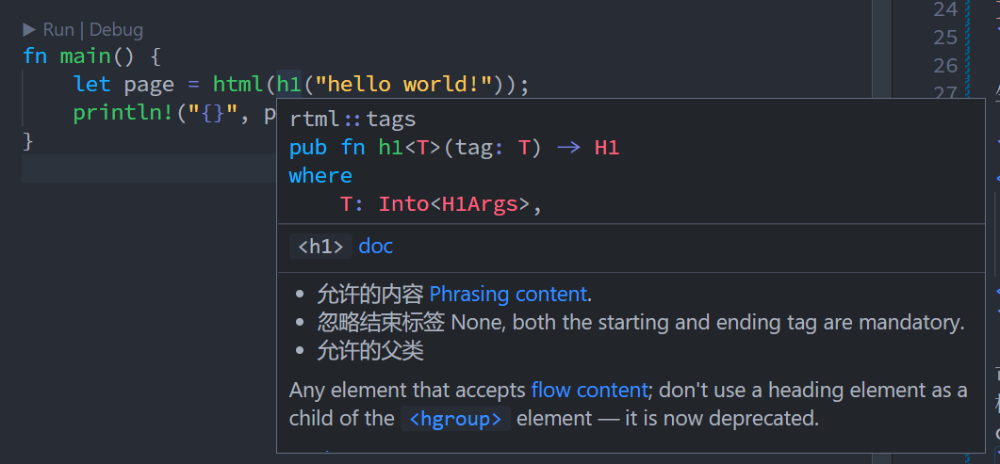
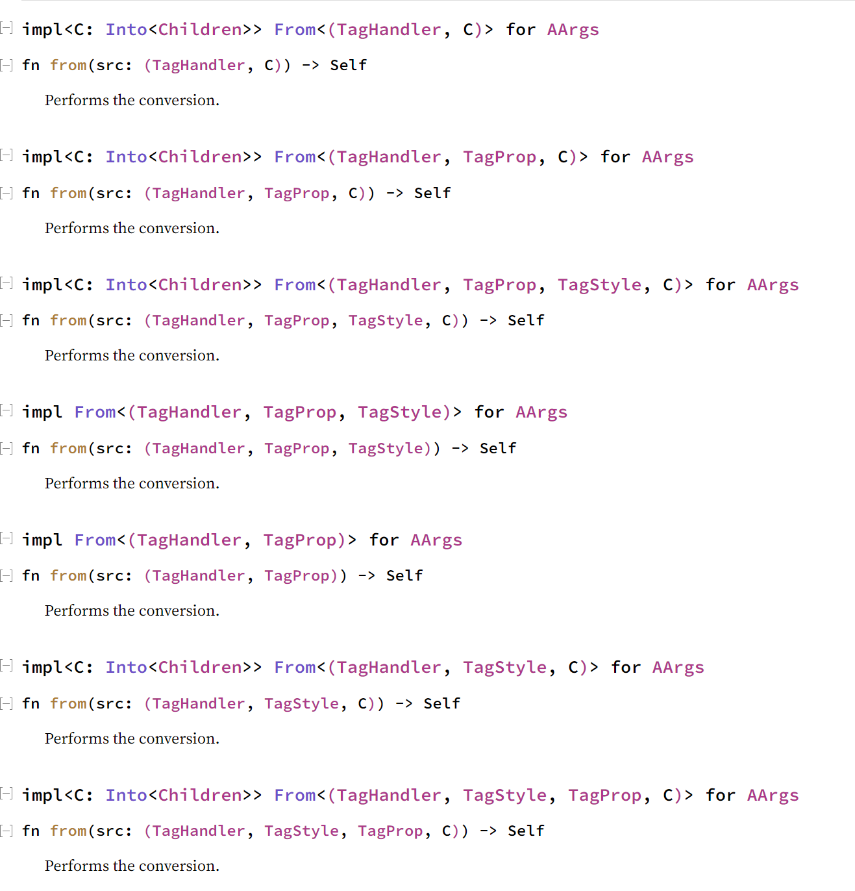
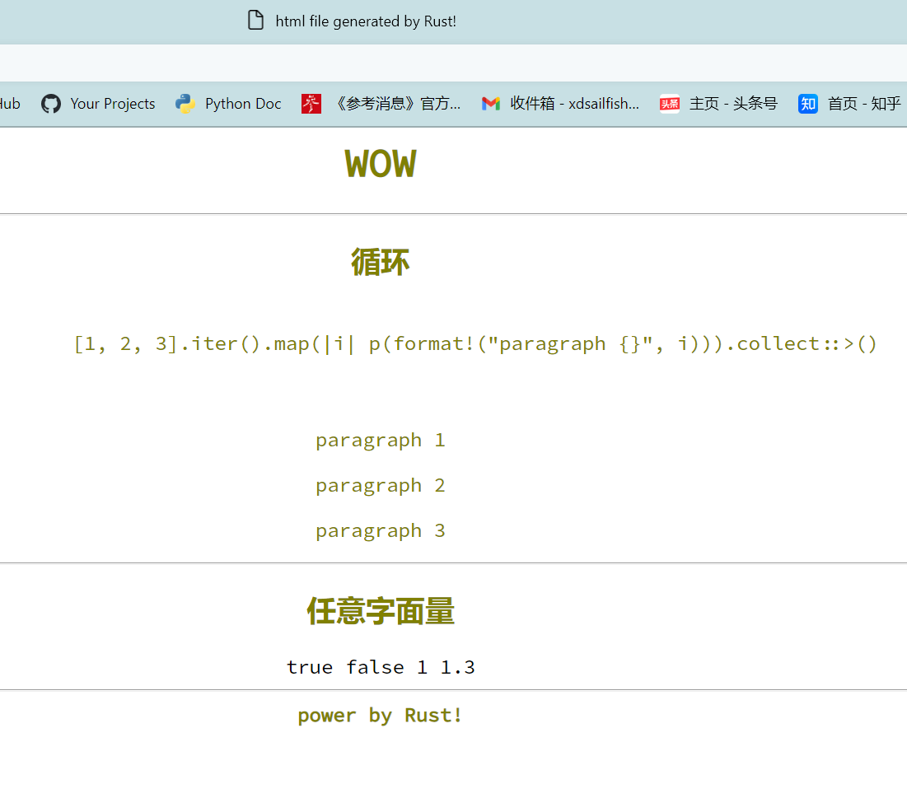

# rtml

在 Rust 中尝试描述 html/css

在通常情况下要在 Rust 中生成 html 除了手动拼字符串外最常用的方式是使用模板引擎, 但这回带来2个主要问题

1. 需要学习模板语法, 且不同模板引擎之间语法可能差异很大
2. 在模板中难以利用 Rust 类型系统, 以及在 IDE 中支持可能不佳

那有没有可能在 Rust 实现 html 那样可以比较方便地展示文档树形结构, 同时又能充分利用 Rust 的类型系统呢, rtml 正是这个想法的一次尝试.

## 使用

先看一个简单例子

```rust
use rtml::tags::*;

fn main() {
    let page = html(
        h1("hello world!")
    );
    println!("{}", page);
}
```

生成 html

```html
<html>
    <h1>
        hello world!
    </h1>
</html>
```

可以看到在 rtml 中, html, h1 和 html 的 `<html>`, `<h1>` 标签对应, 往 `html` 传入的参数是 `<html> </html>` 的 children, `html(h1(...))` 就如同往 `<html>` 标签中间放入 `h1` 标签一样.

注意, 在 rtml 中, `h1`, `div`, 和 `title` 等都是普通的函数(以下简称**标签函数**), 没有使用任何过程宏, 对于有 LSP 支持的 IDE 来说, 悬浮显示, 智能补全, 跳转定义等都没有问题. 而且 rtml 对于标准 html 标签都提供了详细的文档, 方便使用.




### 灵活的 children 传入

对于 rtml 中任意一个标签函数, 其参数虽然只有一个, 但可传入其中, 作为 children 的类型非常多.

#### 常见的字面类型

```rust
// 布尔值
span(true)

// 浮点数
span(1.1f64)

// 字符串
span("hello")

// format! 也OK
let name = "Rookie";
span(format!("hello {name}"))

// 整数
span(666usize)
```

#### 更多类型

```rust
// 任意一个实现 Tag trait 的结构体
div(h1("hello"))

// 元组也OK
// div 传入的参数是一个 (H1, Hr, P) 元组
div((
 h1("hello"),
 hr(()),
 p("this is some desc")
 ))

// Vec 也行
// ul 传入的是一个 
ul(
    [1, 2, 3]
        .iter()
        .map(|i| li(format!("item {i}")))
        .collect::<Vec<_>>()
)

// const generic array 也可以, 如传入 [Span; 2]
div([span(1), span(2)])
```

### 设置属性, 样式和绑定事件处理函数

在 html 标签上, 用户可以设置 id, class 样式等. 为了兼容 html 风格,样式设置格式, rtml 提供了 `style!`, 和 `prop!` 两个宏以方便属性设置. 而且 rtml 传入属性的方式也非常灵活.

如果查看 rtml 文档里某个标签函数参数结构体 xxArgs 的文档, 你会发现它实现很多 `From<xxx>` 方法.



正是这些实现让 rtml 的构造函数很灵活.

对于 `<meta>` 等标签, 通常我们不关系他的 children, 而是要传入 charset 等属性, 这时候你可以这样传参.

```rust
meta(prop! {
    charset = "utf-8"
})
```

对于某些标签来说, 属性, 样式和 children 都需要设置, 除了要求 children 必须在最后一个位置外, 属性和样式可以乱序

```rust
// 注意, 传入的一个三元素元组 
div((
    style!{color: "red"},
    prop! { id = "app" },
    p("hello")
))
```

下面是一个更复杂的例子

```rust
use rtml::prop;
use rtml::style;
use rtml::tags::*;

fn main() {
    let page = html((
        prop! { lang = "zh-cn" },
        (
            header((
                meta(prop! { charset = "utf-8" }),
                title("html file generated by Rust!"),
            )),
            body((
                style! {
                    color: "olive";
                    text-align: "center"
                },
                (
                    h1("WOW"),
                    hr(()),
                    h2("循环"),
                    pre((
                        style! {},
                        code(
                            r#"[1, 2, 3].iter().map(|i| p(format!("paragraph {}", i))).collect::<Vec<_>>()"#,
                        ),
                    )),
                    div([1, 2, 3]
                        .iter()
                        .map(|i| p(format!("paragraph {}", i)))
                        .collect::<Vec<_>>()),
                    hr(()),
                    h2("任意字面量"),
                    div((
                        style! { color: "black" },
                        (span(true), span(false), span(1u8), span(1.30f32)),
                    )),
                    hr(()),
                    footer(b("power by Rust!")),
                ),
            )),
        ),
    ));
    println!("{}", page);
}
```

生成的 html

```html
<html lang=zh-cn>
    <header>
        <meta charset=utf-8>
        </meta>
        <title>
            html file generated by Rust!
        </title>
    </header>
    <body style="color: olive; text-align: center; ">
        <h1>
            WOW
        </h1>
        <hr>
        </hr>
        <h2>
            循环
        </h2>
        <pre>
            <code>
                [1, 2, 3].iter().map(|i| p(format!("paragraph {}", i))).collect::<Vec<_>>()
            </code>
        </pre>
        <div>
            <p>
                paragraph 1
            </p>
            <p>
                paragraph 2
            </p>
            <p>
                paragraph 3
            </p>
        </div>
        <hr>
        </hr>
        <h2>
            任意字面量
        </h2>
        <div style="color: black; ">
            <span>
                true
            </span>
            <span>
                false
            </span>
            <span>
                1
            </span>
            <span>
                1.3
            </span>
        </div>
        <hr>
        </hr>
        <footer>
            <b>
                power by Rust!
            </b>
        </footer>
    </body>
</html>
```

浏览器打开效果如下.



#### TODO 事件函数绑定
